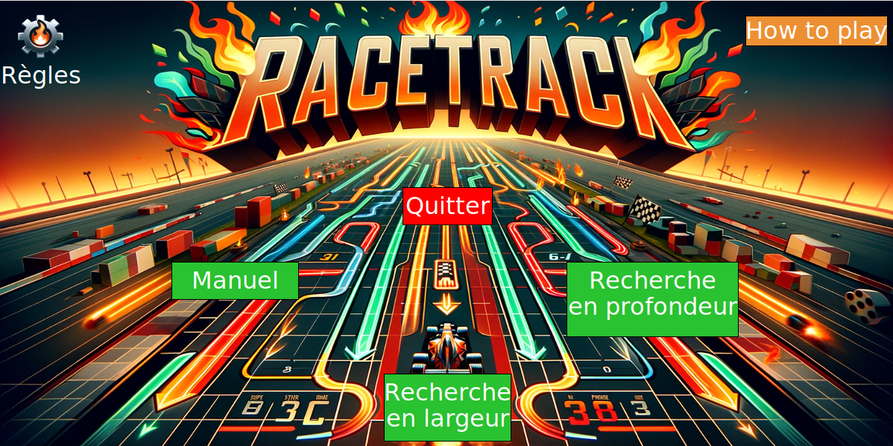

# 🏎️ **Racetrack Game**

## Description  
Ce projet est un petit jeu de course automobile sur grille, basé sur des règles de physique simplifiées avec inertie. Le joueur peut choisir entre un mode manuel (avec clics pour avancer) ou des recherches automatiques (par largeur ou profondeur) pour trouver le meilleur chemin vers l’arrivée.  
L’objectif est d’atteindre la ligne d’arrivée en respectant les contraintes de mouvement et en évitant les obstacles.

---
## Aperçu du jeu  
> Voici l’interface principale du jeu, où vous pouvez choisir entre les différentes options de jeu: 

---
## Concept et Règles du jeu  
- Chaque tour, la vitesse est modifiée par une accélération choisie entre -1, 0 ou +1 sur les axes X et Y ce qui est représenté avec le changement de couleur.  
- Le joueur commence depuis une ou plusieurs cases de départ (indiquées par '>').  
- Le but est d’atteindre l’arrivée (indiquée par '*') sans toucher les obstacles ('#').  
- Deux modes possibles :  
  - **Règles souples** : on vérifie uniquement la case finale.  
  - **Règles strictes** : on vérifie tout le chemin (trajectoire stricte).  
- Plusieurs stratégies possibles :  
  - **Mode manuel** : déplacement au clic.  
  - **Recherche automatique par profondeur (DFS)**.  
  - **Recherche automatique par largeur (BFS)**.

---
## Installation  
1. Assurez-vous d’avoir Python 3 installé sur votre machine.
2. Clonez le dépôt :  
```bash
git clone https://github.com/taousoumaouche/racetrack_python.git
cd racetrack_python
```
3. Lancez le jeu :  
```bash
python3 racetrack.py
```
---
## Structure du projet  
```
/assets             # Images (les images .png et les maps .txt utilisés)
/src                # fltk.py (bibliothèque graphique utilisée)
racetrack.py        # Le code source principal
README.md           # Ce fichier de présentation du projet
```
---
## Auteur
Projet développé par **Oumaouche Taous**, étudiante en **L1 Informatique**.
---

## Licence  
Ce projet est réalisé dans le cadre d’un projet éducatif.  
Utilisation libre à but pédagogique ou personnel.

---
